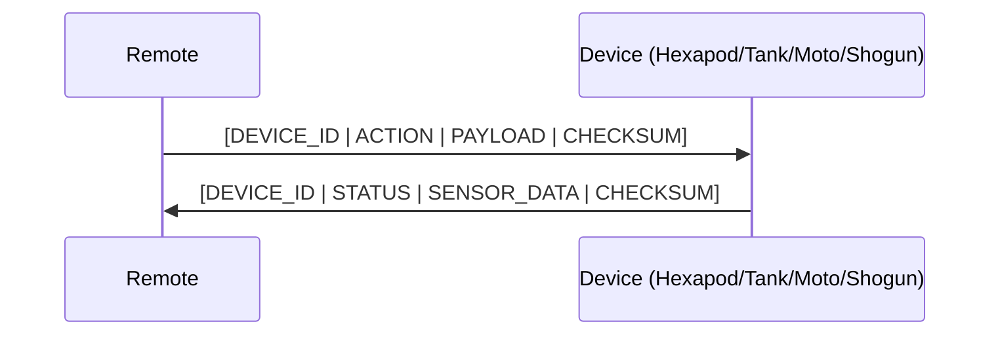

# Shared Libraries

Common code shared across all IoT robotics projects.

## Structure

```
shared/
├── protocol/     # Communication protocol (packet format, device IDs, actions)
└── drivers/      # Reusable hardware drivers (RF/BLE wrapper, servo utils)
```

## Protocol

Defines the common communication layer between the remote controller and all robots.



### Packet Structure

| Field | Size | Description |
|-------|------|-------------|
| Device ID | 1 byte | Target device (0x01-0x04) |
| Action | 1 byte | Command enum value |
| Payload | 0-8 bytes | Action-specific parameters |
| Checksum | 1 byte | XOR of all preceding bytes |

## Drivers

Reusable hardware abstractions:
- **CommunicationDriver**: Abstraction over BT/WiFi/RF24 transport
- **ServoUtils**: Common servo mapping and calibration helpers
