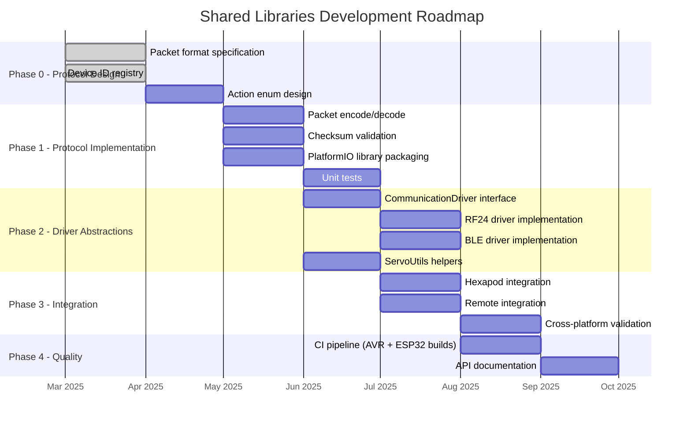

# Shared Libraries Roadmap

## Overview

## Phase 0 — Protocol Design

> Status: **Partially Done**

- [x] Define packet format: `[DEVICE_ID | ACTION | PAYLOAD | CHECKSUM]`
- [x] Assign device IDs (0x01-0x04)
- [ ] Define action enum values per device
  - Common actions: IDLE, PING, STATUS_REQUEST
  - Hexapod-specific: WALK, TURN, DANCE, FIGHT, etc.
  - Tank-specific: DRIVE, TURRET, FIRE
  - Moto-specific: THROTTLE, STEER
  - Shogun-specific: ASSEMBLE, DISASSEMBLE
- [ ] Define payload structures per action
- [ ] Define status response format (device -> remote)

## Phase 1 — Protocol Implementation

> Status: **Planned**

### Packet encode/decode
- [ ] `Packet` struct (packed, no dynamic allocation)
- [ ] `encodePacket()` — struct to byte array
- [ ] `decodePacket()` — byte array to struct
- [ ] Checksum: XOR of all bytes before checksum field
- [ ] `validateChecksum()` — verify integrity

### PlatformIO library packaging
- [ ] Create `library.json` manifest
- [ ] Test as `lib_deps` from GitHub URL
- [ ] Test as `lib_extra_dirs` for local dev
- [ ] Verify compilation on AVR (Mega 2560) and ESP32

### Unit tests
- [ ] Test encode/decode round-trip
- [ ] Test checksum calculation and validation
- [ ] Test malformed packet handling
- [ ] Test all device ID and action combinations

## Phase 2 — Driver Abstractions

> Status: **Planned**

### CommunicationDriver interface
- [ ] Abstract base class with `send()` and `receive()`
- [ ] RF24 concrete implementation (NRF24L01)
- [ ] BLE concrete implementation (ESP32 BLE)
- [ ] WiFi concrete implementation (ESP32 WiFi — optional)
- [ ] Factory or compile-time selection via build flags

### ServoUtils
- [ ] Degree to PWM pulse length conversion
- [ ] Servo range clamping with configurable min/max
- [ ] Left/right mirror calculation
- [ ] Smooth movement interpolation helpers

## Phase 3 — Integration

> Status: **Planned**

- [ ] Replace hexapod's inline protocol code with shared lib
- [ ] Integrate into remote controller firmware
- [ ] End-to-end test: remote -> hexapod via shared protocol
- [ ] Validate on both AVR and ESP32 platforms

## Phase 4 — Quality

> Status: **Planned**

- [ ] GitHub Actions CI: build on AVR + ESP32 targets
- [ ] Unit test execution in CI
- [ ] API documentation (Doxygen or inline comments)
- [ ] Versioning strategy (semver tags)
